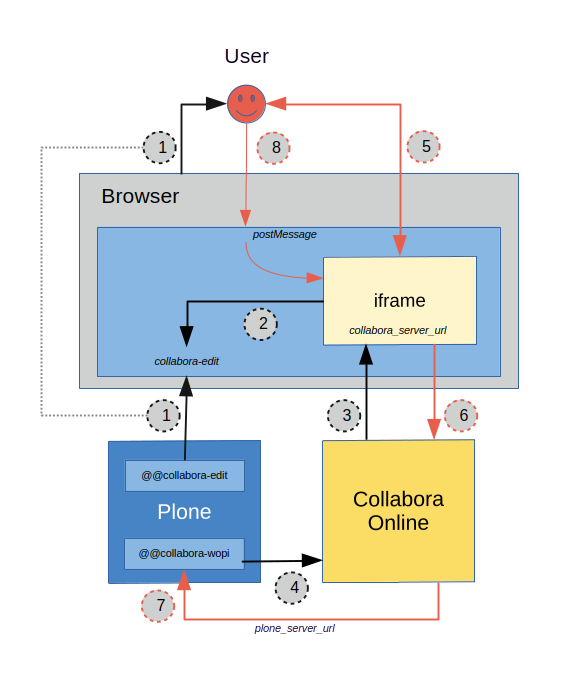

.. This README is meant for consumption by humans and PyPI. PyPI can render rst files so please do not use Sphinx features.
   If you want to learn more about writing documentation, please check out: http://docs.plone.org/about/documentation_styleguide.html
   This text does not appear on PyPI or github. It is a comment.

.. image:: https://github.com/collective/collective.collabora/actions/workflows/plone-package.yml/badge.svg
    :target: https://github.com/collective/collective.collabora/actions/workflows/plone-package.yml

.. image:: https://img.shields.io/endpoint?url=https://gist.githubusercontent.com/gyst/2a12a9fe2dbca0d4337ca96603bd58d7/raw/covbadge.json
    :alt: Coverage

.. image:: https://img.shields.io/pypi/v/collective.collabora.svg
    :target: https://pypi.python.org/pypi/collective.collabora/
    :alt: Latest Version

.. image:: https://img.shields.io/pypi/status/collective.collabora.svg
    :target: https://pypi.python.org/pypi/collective.collabora
    :alt: Egg Status

.. image:: https://img.shields.io/pypi/pyversions/collective.collabora.svg?style=plastic
    :alt: Supported - Python Versions

.. image:: https://img.shields.io/pypi/l/collective.collabora.svg
    :target: https://pypi.python.org/pypi/collective.collabora/
    :alt: License

====================
collective.collabora
====================

Collabora Online integration for Plone.

Introduction
============

Features
--------

See https://www.collaboraonline.com/.

- Real-time collaborative document editing of office-type documents: Word
  documents, spreadsheets, etc.

- Reading Office files and PDFs in your browser in a Plone page, with comments,
  even if you do not have edit rights.

- Wide compatibility of this add-on across Plone and Python versions.

Status: alpha
-------------

Development alpha, not suitable for production use yet.

Things that need to implemented/improved/tested:

- Locking and lock stealing, especially when files are modified Plone-side

- Multihost/multisite: multiple Plones talking to the same Collabora server

- Exposing/tweaking the COOL configuration

- Translations

- Plone4 backport

- Overall testing and UI polishing

Authors
-------

- Johannes Raggam (thet)
- Guido A.J. Stevens (gyst)

Contribute
----------

- Issue Tracker: https://github.com/collective/collective.collabora/issues
- Source Code: https://github.com/collective/collective.collabora

Support
-------

If you are having issues, please let us know via the `issue tracker
<https://github.com/collective/collective.collabora/issues>`_.

This package is part of `Quaive <https://quaive.com>`_ and supported by the
Quaive partners Cosent, Syslab.com and iMio.

Development of this package was sponsored by `iMio <https://imio.be>`_ and
`Syslab.com <https://syslab.com>`_.

License
-------

The project is licensed under the GPLv2.

Usage
=====

Installation
------------

Install collective.collabora by adding it to your buildout::

    [buildout]

    ...

    eggs =
        collective.collabora

and then running ``bin/buildout``.

You can then install collective.collabora though the add-on control panel.

For this to work, you need to have a Collabora Online service up and running.

See:

- https://sdk.collaboraonline.com/docs/installation/index.html

See *Development* below for instructions on running a development setup.

Configuration
-------------

There is a single registry record you need to configure:
``collective.collabora.server_url``. This should be a publicly accessible URL
that accesses (is reverse proxied to) your Collabora server.

See:

- https://sdk.collaboraonline.com/docs/installation/Proxy_settings.html

- https://sdk.collaboraonline.com/docs/installation/Configuration.html#network-settings

By default, ``collective.collabora.server_url`` is configured to
``http://host.docker.internal:9980``, which is suitable for development but
needs to be changed for production deployment.

Architecture and interaction flow
=================================

There are three main components in play:

1. The browser.

2. Plone server, providing two views: the user-facing ``@@cool_edit`` view, and
   the Collabora callback API ``@@cool_wopi``.

3. Collabora Online server.

Collabora needs to be accessible from the browser.
Plone needs to be not only accessible from the browser, but *also from Collabora*.

The following diagram illustrates the information flow.

Opening a file for read access
------------------------------

1. Open the Plone view ``@@cool_edit``. This is integrated in the Plone UI as an
   action called ``Open``.

2. The ``cool_edit`` view renders with an iframe.

3. The iframe loads the Collabora Online UI. The URL for that iframe contains
   the callback URL ``cool_wopi`` that Collabora will use to communicate with
   Plone in steps (4) and (7).

4. Collabora retrieves the file to be edited directly from Plone, outside of the
   browser, by accessing the WOPI URL ``@@cool_wopi``. It uses a JWT access
   token encoded in the iframe URL to connect to Plone as the user that has
   opened ``cool_edit``.

The file is now rendered in the iframe in the browser. If the user has ``View``
permissions, but not ``Modify portal content``, the flow ends here. The user can
read the document and any comments other collaborators made on the document in
Collabora.

Editing a file and saving changes
---------------------------------

5. If the user opening the document has ``Modify portal content`` permission on
   the file, a real-time editing session is opened.

6. Any changes the user makes to the document, will be autosaved.

7. The save is performed by Collabora issuing a POST request to the Plone view
   ``@@cool_wopi``. That view checks permissions, and performs the save. In case
   of a write/locking conflict, that's communicated back to Collabora which will
   open a UI for the user to resolve this.

8. Some actions, like ``Save and exit``, can be performed on the ``cool_edit``
   view outside of the iframe. The Plone document communicates such actions to
   the Collabora iframe via the postMessage API, see:
   https://sdk.collaboraonline.com/docs/postmessage_api.html

Development
===========

For full SDK integration documentation docs, see:

- https://sdk.collaboraonline.com/docs/advanced_integration.html

Development setup
-----------------

This package provides a default configuration that is suitable for development:

- The provided ``docker-compose.yaml`` runs the CODE server on
  ``http://host.docker.internal:9980``, if you run ``docker compose up`` in the
  package root directory.

- The ``collective.collabora:default`` profile configures the registry record
  ``collective.collabora.server_url`` to point at that CODE server at that URL.

Note that if you're accessing Collabora Online from multiple hostnames/aliases,
it will bind to the first one by default and disallow any other connections.

See:

- https://sdk.collaboraonline.com/docs/installation/Configuration.html#multihost-configuration

No localhost
++++++++++++

Use ``host.docker.internal`` instead of ``localhost``.

For this package to work you *cannot* access your Plone site on ``localhost``.
Plone provides its own URL to Collabora, and Collabora performs callbacks on
that URL. Obviously if Collabora tries to access localhost, it will reach itself
and not Plone. Protections against this misconfiguration are built into the
code.

Instead, add an alias in your ``/etc/hosts``::

  172.17.0.1      host.docker.internal

which binds to the docker bridge IP. This will enable COOL to connect to Plone.

Building, testing and CI
------------------------

This package uses ``tox`` to drive buildout and test runners.

See the provided ``Makefile`` for some usage pointers.
To build and test all environments::

  make all

To run a single development server::

  make start60

To run all tests for only that environment::

  tox -e py312-Plone60

To run a single test in a single environment and spawn a debugger::

  tox -e py312-Plone60 -- -t your_test_substring -D -x

To run all linters in parallel::

  tox -p -f lint

Github CI testing is configured in::

  .github/workflows/plone-package.yml

For the tox CLI documentation, see:

- https://tox.wiki/en/latest/cli_interface.html
